# WebApplication for Event Registration

## AIM:
To create a UX design and develop a web application for event registration.
## DESIGN STEPS:


## DESIGN SCREENS:
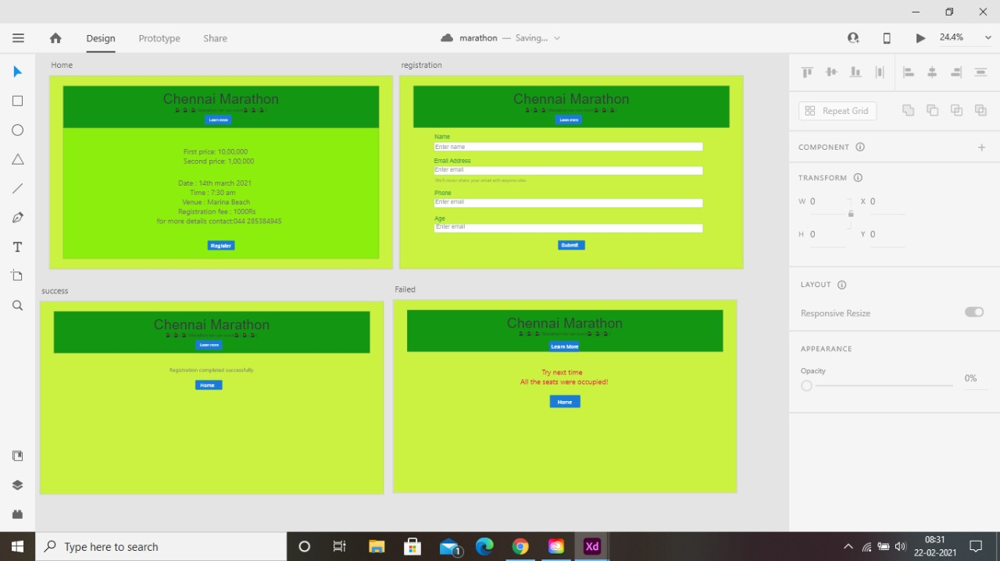

## WIREFRAME:
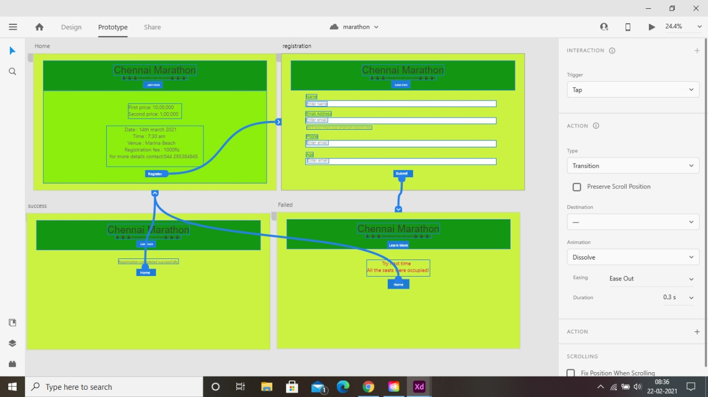

## PROTOTYPE:

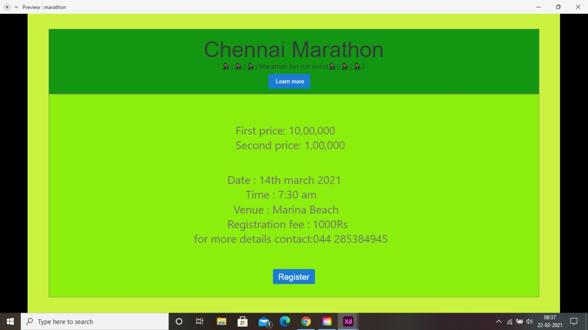
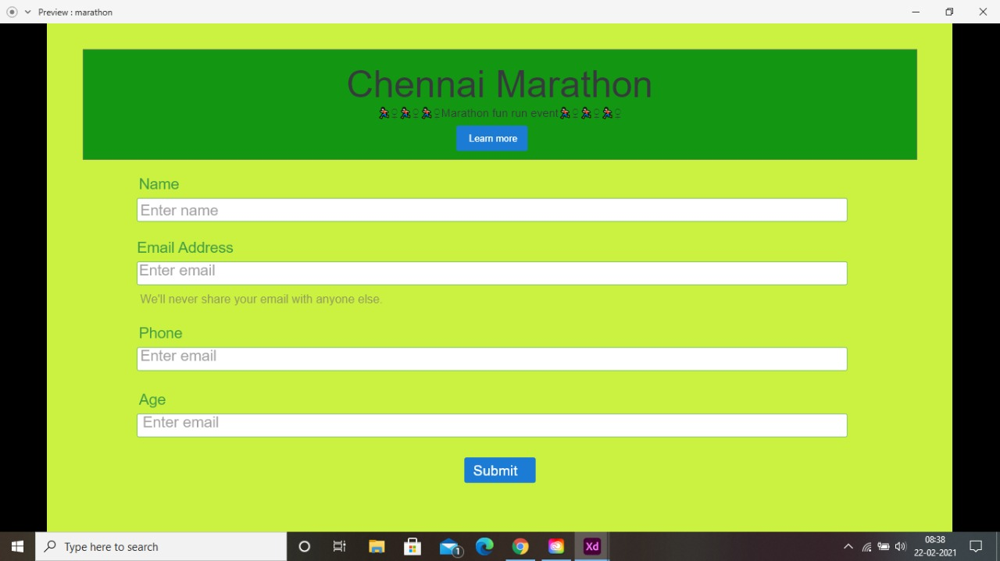
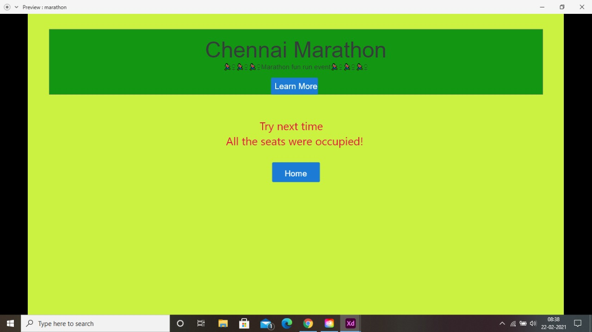
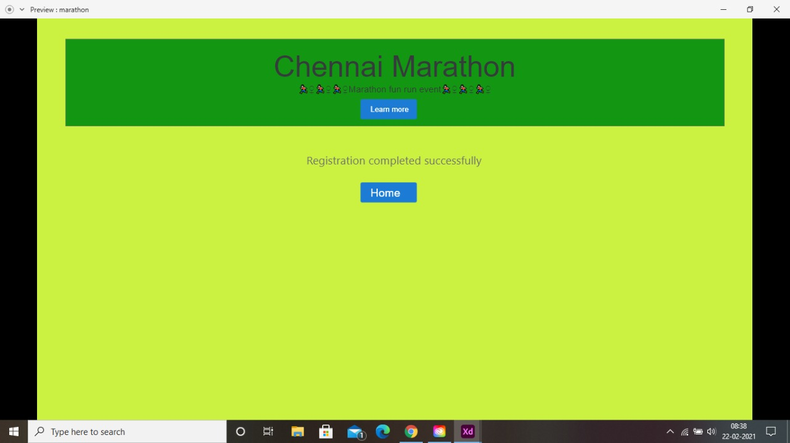


## PROGRAM:
### home.html
```
<!doctype html>
<html lang="en">

<head>
    <!-- Required meta tags -->
    <meta charset="utf-8">
    <meta name="viewport" content="width=device-width, initial-scale=1, shrink-to-fit=no">

    <!-- Bootstrap CSS -->
    <link rel="stylesheet" href="https://maxcdn.bootstrapcdn.com/bootstrap/4.0.0/css/bootstrap.min.css"
        integrity="sha384-Gn5384xqQ1aoWXA+058RXPxPg6fy4IWvTNh0E263XmFcJlSAwiGgFAW/dAiS6JXm" crossorigin="anonymous">

    <title>Chennai Marathon</title>
</head>

<body>
        <div class="jumbotron" style="background-color:rgb(203, 241, 65);">
            <div style="background-color: rgb(19, 151, 19);">
                <div class="container text-center">
                    <h1 class="display-4">Chennai Marathon</h1>
                    <h6 class="display-5">🏃🏻‍♀️🏃🏻‍♀️🏃🏻‍♀️Marathon fun run event🏃🏻‍♀️🏃🏻‍♀️🏃🏻‍♀️</h6>
                </div>
                <div class="container text-center">
                <a class="btn btn-primary btn-lg" href="#" role="button">Learn more</a>
            </div>

        </div>
    <div style="background-color: rgb(140, 238, 12);">
    <div class="container text-center">
        
            <div class="card-body">
                <p class="lead"> First price: 10,00,000 <br>Second price: 1,00,000</p>
                <hr class="my-4">
            </div>
        </div>
        <div class="container text-center">

            <div class="card-body">
                    <p class="lead"> Date : 14th march 2021<br> Time : 7:30 am<br> Venue : Marina Beach<br> Registration
                        fee
                        : 1000Rs<br> for more details contact:044 285384945</p>
                    <hr class="my-4">
                    <p class="lead">
                </div>
            
            <a class="btn btn-primary btn-lg" href="/registration/" role="button">Register</a>
            </p>
        </div>
    </div>
</div>
    <!-- Optional JavaScript -->
    <!-- jQuery first, then Popper.js, then Bootstrap JS -->
    <script src="https://code.jquery.com/jquery-3.2.1.slim.min.js"
        integrity="sha384-KJ3o2DKtIkvYIK3UENzmM7KCkRr/rE9/Qpg6aAZGJwFDMVNA/GpGFF93hXpG5KkN"
        crossorigin="anonymous"></script>
    <script src="https://cdnjs.cloudflare.com/ajax/libs/popper.js/1.12.9/umd/popper.min.js"
        integrity="sha384-ApNbgh9B+Y1QKtv3Rn7W3mgPxhU9K/ScQsAP7hUibX39j7fakFPskvXusvfa0b4Q"
        crossorigin="anonymous"></script>
    <script src="https://maxcdn.bootstrapcdn.com/bootstrap/4.0.0/js/bootstrap.min.js"
        integrity="sha384-JZR6Spejh4U02d8jOt6vLEHfe/JQGiRRSQQxSfFWpi1MquVdAyjUar5+76PVCmYl"
        crossorigin="anonymous"></script>
</body>

</html>
```

### Registration.html
```
<!doctype html>
<html lang="en">
  <head>
    <!-- Required meta tags -->
    <meta charset="utf-8">
    <meta name="viewport" content="width=device-width, initial-scale=1, shrink-to-fit=no">

    <!-- Bootstrap CSS -->
    <link rel="stylesheet" href="https://maxcdn.bootstrapcdn.com/bootstrap/4.0.0/css/bootstrap.min.css" integrity="sha384-Gn5384xqQ1aoWXA+058RXPxPg6fy4IWvTNh0E263XmFcJlSAwiGgFAW/dAiS6JXm" crossorigin="anonymous">

   <title>Registration Page</title>
  </head>
  <body>
     <div class="jumbotron" style="background-color:rgb(203, 241, 65);">
            <div style="background-color: rgb(19, 151, 19);">
                <div class="container text-center">
                    <h1 class="display-4">Chennai Marathon</h1>
                    <h6 class="display-5">🏃🏻‍♀️🏃🏻‍♀️🏃🏻‍♀️Marathon fun run event🏃🏻‍♀️🏃🏻‍♀️🏃🏻‍♀️</h6>
                </div>
                <div class="container text-center">
                <a class="btn btn-primary btn-lg" href="#" role="button">Learn more</a>
            </div>

</div>
<div class="container">
<form action="/registration/" method="POST">
    
    <div class="form-group">
    <label for="exampleInputPassword1">Name</label>
    <input type="name" class="form-control" id="name" placeholder="Enter name">
  </div>
  <div class="form-group">
    <label for="exampleInputEmail1">Email address</label>
    <input type="email" class="form-control" id="exampleInputEmail1" aria-describedby="emailHelp" placeholder="Enter email">
    <small id="emailHelp" class="form-text text-muted">We'll never share your email with anyone else.</small>
  </div>
  <div class="form-group">
    <label for="exampleInputPassword1">Phone</label>
    <input type="Phone" class="form-control" id="Phone" placeholder="Enter Phone number">
  </div>
  <div class="form-group">
    <label for="exampleInputPassword1">Age</label>
    <input type="age" class="form-control" id="age" placeholder="Enter age">
  </div>
</div>
   <div class="container text-center">
  <button type="submit" class="btn btn-primary" href="/success/">Submit</button>
  </div>
  
</form>
</div>


    <!-- Optional JavaScript -->
    <!-- jQuery first, then Popper.js, then Bootstrap JS -->
    <script src="https://code.jquery.com/jquery-3.2.1.slim.min.js" integrity="sha384-KJ3o2DKtIkvYIK3UENzmM7KCkRr/rE9/Qpg6aAZGJwFDMVNA/GpGFF93hXpG5KkN" crossorigin="anonymous"></script>
    <script src="https://cdnjs.cloudflare.com/ajax/libs/popper.js/1.12.9/umd/popper.min.js" integrity="sha384-ApNbgh9B+Y1QKtv3Rn7W3mgPxhU9K/ScQsAP7hUibX39j7fakFPskvXusvfa0b4Q" crossorigin="anonymous"></script>
    <script src="https://maxcdn.bootstrapcdn.com/bootstrap/4.0.0/js/bootstrap.min.js" integrity="sha384-JZR6Spejh4U02d8jOt6vLEHfe/JQGiRRSQQxSfFWpi1MquVdAyjUar5+76PVCmYl" crossorigin="anonymous"></script>
  </body>
</html>
```
### success.html
```
<!doctype html>
<html lang="en">

<head>
    <!-- Required meta tags -->
    <meta charset="utf-8">
    <meta name="viewport" content="width=device-width, initial-scale=1, shrink-to-fit=no">

    <!-- Bootstrap CSS -->
    <link rel="stylesheet" href="https://maxcdn.bootstrapcdn.com/bootstrap/4.0.0/css/bootstrap.min.css"
        integrity="sha384-Gn5384xqQ1aoWXA+058RXPxPg6fy4IWvTNh0E263XmFcJlSAwiGgFAW/dAiS6JXm" crossorigin="anonymous">

    <title>Chennai Marathon</title>
</head>

<body>
    <div style="background-color:rgb(203, 241, 65);">
        <div class="jumbotron">
            <div style="background-color: rgb(19, 151, 19);">
                <div class="container text-center">
                    <h1 class="display-4">Chennai Marathon</h1>
                    <h6 class="display-5">🏃🏻‍♀️🏃🏻‍♀️🏃🏻‍♀️Marathon fun run event🏃🏻‍♀️🏃🏻‍♀️🏃🏻‍♀️</h6>
                </div>
            </div>
        </div>
        <div class="container text-center">
            <hr class="my-4">
            <p class="lead">
            <div class="row">
                <div class="col-12 text-center ">
                    Registration completed successfully<br>
                </div>
            </div>
            <a class="btn btn-primary btn-lg" href="/home/" role="button">Home</a>
            <br><br><br><br><br><br><br><br><br><br><br><br><br>
            </p>
        </div>
    </div>


    <!-- Optional JavaScript -->
    <!-- jQuery first, then Popper.js, then Bootstrap JS -->
    <script src="https://code.jquery.com/jquery-3.2.1.slim.min.js"
        integrity="sha384-KJ3o2DKtIkvYIK3UENzmM7KCkRr/rE9/Qpg6aAZGJwFDMVNA/GpGFF93hXpG5KkN"
        crossorigin="anonymous"></script>
    <script src="https://cdnjs.cloudflare.com/ajax/libs/popper.js/1.12.9/umd/popper.min.js"
        integrity="sha384-ApNbgh9B+Y1QKtv3Rn7W3mgPxhU9K/ScQsAP7hUibX39j7fakFPskvXusvfa0b4Q"
        crossorigin="anonymous"></script>
    <script src="https://maxcdn.bootstrapcdn.com/bootstrap/4.0.0/js/bootstrap.min.js"
        integrity="sha384-JZR6Spejh4U02d8jOt6vLEHfe/JQGiRRSQQxSfFWpi1MquVdAyjUar5+76PVCmYl"
        crossorigin="anonymous"></script>
</body>

</html>
```
### Failed.html
```
<!doctype html>
<html lang="en">

<head>
    <!-- Required meta tags -->
    <meta charset="utf-8">
    <meta name="viewport" content="width=device-width, initial-scale=1, shrink-to-fit=no">

    <!-- Bootstrap CSS -->
    <link rel="stylesheet" href="https://maxcdn.bootstrapcdn.com/bootstrap/4.0.0/css/bootstrap.min.css"
        integrity="sha384-Gn5384xqQ1aoWXA+058RXPxPg6fy4IWvTNh0E263XmFcJlSAwiGgFAW/dAiS6JXm" crossorigin="anonymous">

    <title>Chennai Marathon</title>
</head>

<body>
    <div  style="background-color:rgb(203, 241, 65);">
    <div class="jumbotron">
        
            <div style="background-color: rgb(19, 151, 19);">
                <div class="container text-center">
                    <h1 class="display-4">Chennai Marathon</h1>
                    <h6 class="display-5">🏃🏻‍♀️🏃🏻‍♀️🏃🏻‍♀️Marathon fun run event🏃🏻‍♀️🏃🏻‍♀️🏃🏻‍♀️</h6>
                </div>
    </div>
    </div>
    <div>
        <div class="row">
            <div class="col-12 text-center text-danger">
                Try next time <br>
                All the seats were occupied!
            </div>
        </div>
    </div>
    <div class="container text-center">
        <a class="btn btn-primary btn-lg" href="/home/" role="button">Home</a>
<br><br><br><br><br><br><br><br><br><br><br><br><br>
    </div>
    </div>
    </div>
    
    <!-- Optional JavaScript -->
    <!-- jQuery first, then Popper.js, then Bootstrap JS -->
    <script src="https://code.jquery.com/jquery-3.2.1.slim.min.js"
        integrity="sha384-KJ3o2DKtIkvYIK3UENzmM7KCkRr/rE9/Qpg6aAZGJwFDMVNA/GpGFF93hXpG5KkN"
        crossorigin="anonymous"></script>
    <script src="https://cdnjs.cloudflare.com/ajax/libs/popper.js/1.12.9/umd/popper.min.js"
        integrity="sha384-ApNbgh9B+Y1QKtv3Rn7W3mgPxhU9K/ScQsAP7hUibX39j7fakFPskvXusvfa0b4Q"
        crossorigin="anonymous"></script>
    <script src="https://maxcdn.bootstrapcdn.com/bootstrap/4.0.0/js/bootstrap.min.js"
        integrity="sha384-JZR6Spejh4U02d8jOt6vLEHfe/JQGiRRSQQxSfFWpi1MquVdAyjUar5+76PVCmYl"
        crossorigin="anonymous"></script>
</body>

</html>
```
### listofparticipants.html
```
<!doctype html>
<html lang="en">

<head>
    <!-- Required meta tags -->
    <meta charset="utf-8">
    <meta name="viewport" content="width=device-width, initial-scale=1, shrink-to-fit=no">

    <!-- Bootstrap CSS -->
    <link rel="stylesheet" href="https://maxcdn.bootstrapcdn.com/bootstrap/4.0.0/css/bootstrap.min.css"
        integrity="sha384-Gn5384xqQ1aoWXA+058RXPxPg6fy4IWvTNh0E263XmFcJlSAwiGgFAW/dAiS6JXm" crossorigin="anonymous">

    <title>Chennai Marathon</title>
</head>

<body>
    <div class="jumbotron" style="background-color:rgb(203, 241, 65);">
            <div style="background-color: rgb(19, 151, 19);">
                <div class="container text-center">
                    <h1 class="display-4">Chennai Marathon</h1>
                    <h6 class="display-5">🏃🏻‍♀️🏃🏻‍♀️🏃🏻‍♀️Marathon fun run event🏃🏻‍♀️🏃🏻‍♀️🏃🏻‍♀️</h6>
                </div>
    </div>
    <div class="container">
        <div class="row">
            <div class="col-12">
                <h1>Chennai Marathon</h1>
            </div>
        </div>
        <div class="row">
            <div class="col-12">
                <table class="table">
                    <thead>
                        <tr>
                            <th scope="col">Name</th>
                            <th scope="col">Email address</th>
                            <th scope="col">Phone</th>
                            <th scope="col">Age</th>
                        </tr>
                    </thead>
                    <tbody>

                        <tr>
                            <td>Arohi</td>
                            <td>Arohi@gmail.com</td>
                            <td>935794279</td>
                            <td>25</td>
                        </tr>

                        <tr>
                            <td>ishan</td>
                            <td>ishan@gmail.com</td>
                            <td>946729745</td>
                            <td>28</td>
                        </tr>

                        <tr>
                            <td>rahul</td>
                            <td>rahulc@gmail.com</td>
                            <td>8654902654</td>
                            <td>35</td>
                        </tr>

                        <tr>
                            <td>ragu</td>
                            <td>ragu@gmail.com</td>
                            <td>6387452892</td>
                            <td>30</td>
                        </tr>

                        <tr>
                            <td>Zoya</td>
                            <td>Zoya@gmail.com</td>
                            <td>8378409924</td>
                            <td>25</td>
                        </tr>

                        <tr>
                            <td>Parma</td>
                            <td>Parma@gmail.com</td>
                            <td>9362897467</td>
                            <td>30</td>
                        </tr>

                        <tr>
                            <td>Adhi</td>
                            <td>Adhi@gmail.com</td>
                            <td>9467290746</td>
                            <td>37</td>
                        </tr>

                        <tr>
                            <td>Mansoor</td>
                            <td>mansoor@gmail.com</td>
                            <td>9764820843</td>
                            <td>50</td>
                        </tr>

                        <tr>
                            <td>Shiv</td>
                            <td>shiv@gmail.com</td>
                            <td>9794752789</td>
                            <td>29</td>
                        </tr>

                        <tr>
                            <td>Anirudh</td>
                            <td>anirudh@gmail.com</td>
                            <td>8265492097</td>
                            <td>26</td>
                        </tr>

                        <tr>
                            <td>Dhoni</td>
                            <td>dhoni@gmail.com</td>
                            <td>964756382</td>
                            <td>45</td>
                        </tr>

                        <tr>
                            <td>Sarfaraz</td>
                            <td>sarfaraz@gmail.com</td>
                            <td>7839246822</td>
                            <td>45</td>
                        </tr>

                        <tr>
                            <td>Ria</td>
                            <td>ria@gmail.com</td>
                            <td>9847389247</td>
                            <td>56</td>
                        </tr>

                        <tr>
                            <td>Ananya</td>
                            <td>ananya@gmail.com</td>
                            <td>9937856673</td>
                            <td>35</td>
                        </tr>

                    </tbody>
                </table>
            </div>
        </div>
        <div class="row">
            <div class="col-12 text-center">
                <a href="/home/" class="btn btn-primary btn-lg" role="button">Home</a>
            </div>
        </div>
    </div>
</div>

    <!-- Optional JavaScript -->
    <!-- jQuery first, then Popper.js, then Bootstrap JS -->
    <script src="https://code.jquery.com/jquery-3.2.1.slim.min.js"
        integrity="sha384-KJ3o2DKtIkvYIK3UENzmM7KCkRr/rE9/Qpg6aAZGJwFDMVNA/GpGFF93hXpG5KkN"
        crossorigin="anonymous"></script>
    <script src="https://cdnjs.cloudflare.com/ajax/libs/popper.js/1.12.9/umd/popper.min.js"
        integrity="sha384-ApNbgh9B+Y1QKtv3Rn7W3mgPxhU9K/ScQsAP7hUibX39j7fakFPskvXusvfa0b4Q"
        crossorigin="anonymous"></script>
    <script src="https://maxcdn.bootstrapcdn.com/bootstrap/4.0.0/js/bootstrap.min.js"
        integrity="sha384-JZR6Spejh4U02d8jOt6vLEHfe/JQGiRRSQQxSfFWpi1MquVdAyjUar5+76PVCmYl"
        crossorigin="anonymous"></script>
</body>

</html>
```

## OUTPUT:

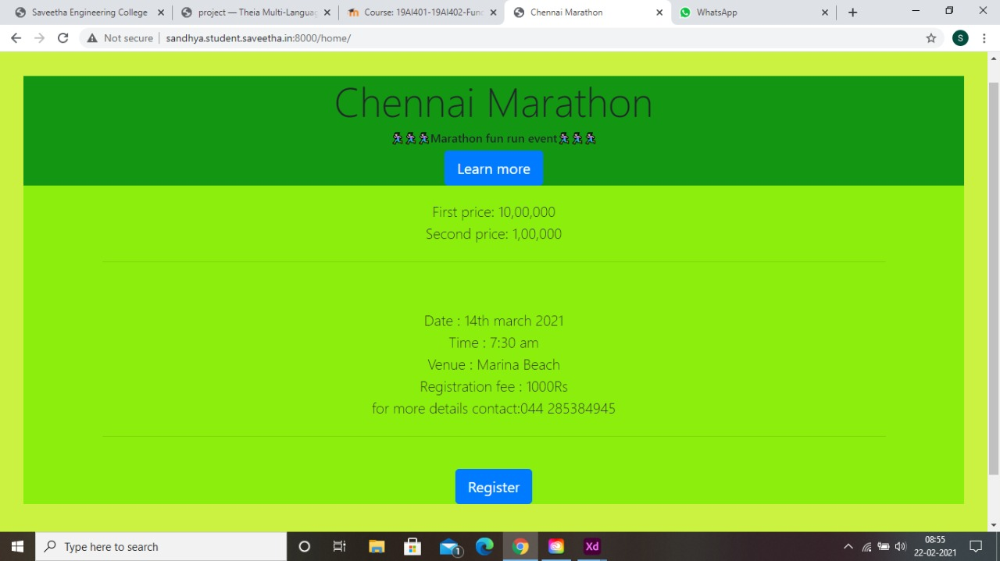
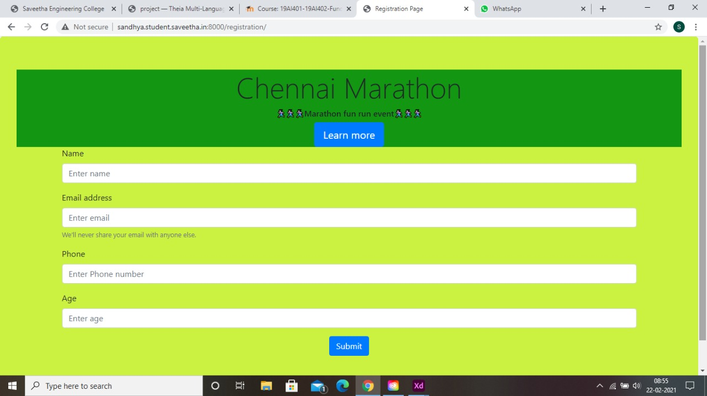
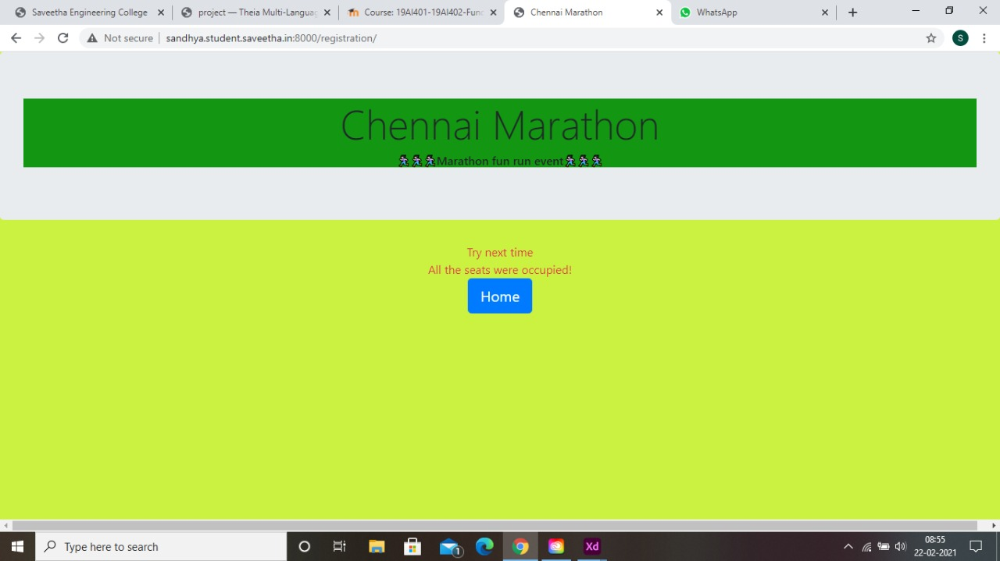
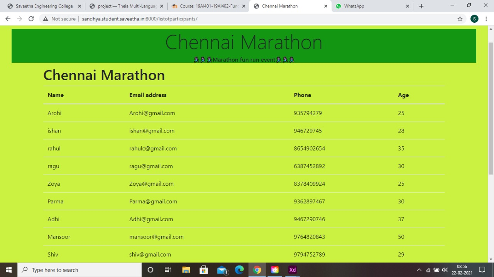
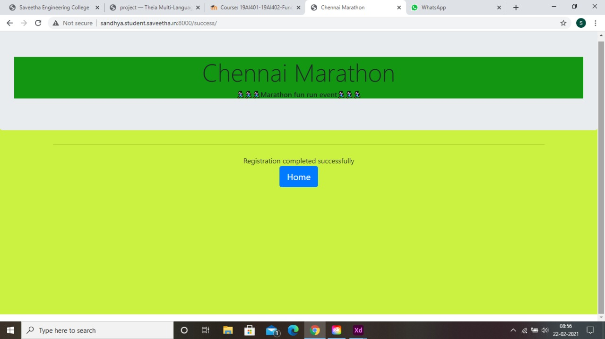

## RESULT:
Thus a website is designed for the eventregistration and is hosted in the URL http://sandhya.student.saveetha.in:8000/home. HTML code is validated.

